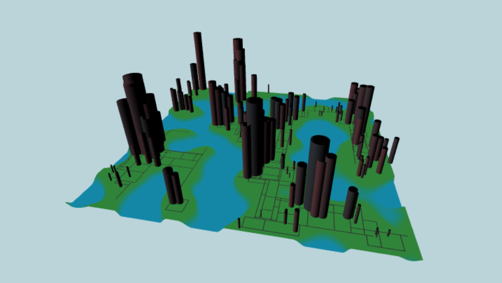
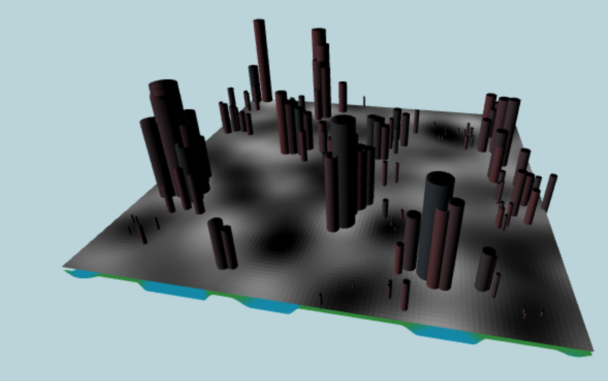
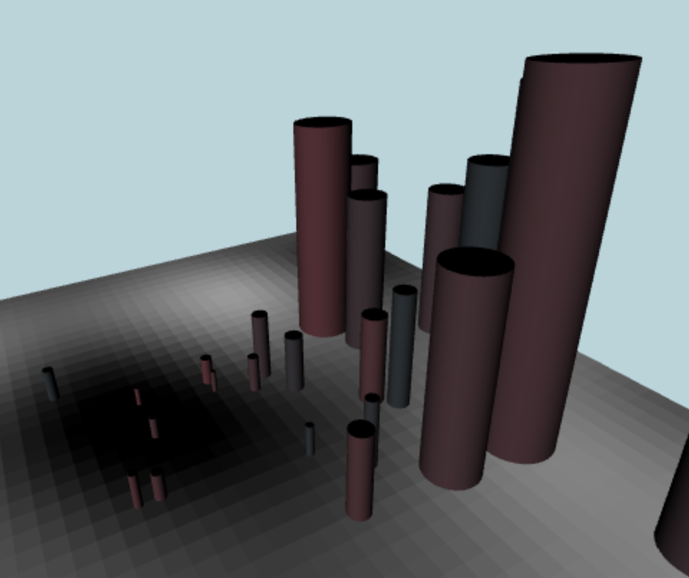
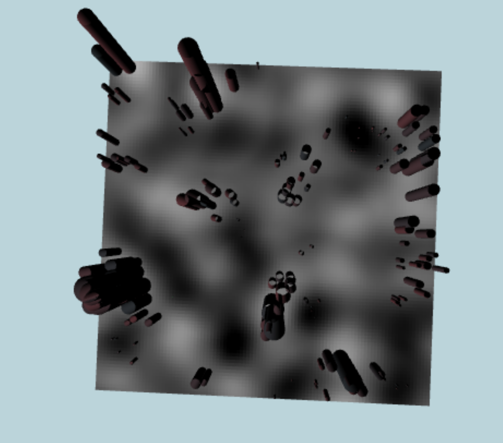
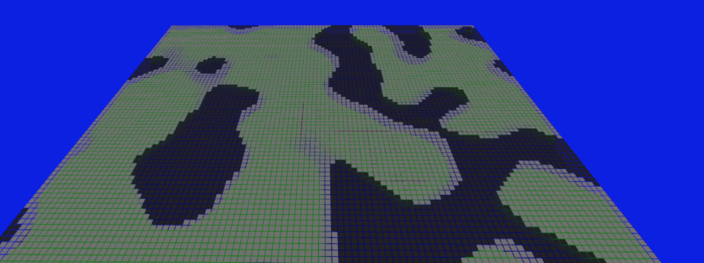

# CIS 566 Homework 6: City Generation

## Overview

Matthew Riley\
PennKey: matriley\
Live at: https://mgriley.github.io/hw06-city-generation/

Above is a screenshot of the final product.

Here is the population density shown over the terrain. The back regions are low density and white regions high density.

Buildings constructed in regions of low population density are smaller, modeling residential areas.

Here is the same population density grid displayed from the top.

This screenshot shows a debug rendering of the validity grid, where the color of each grid square indicates the land height at that location. The darker regions are bodies of water.

## Description:

Here is an overview of what I accomplished:

Done:
- Generates a terrain mesh from noise texture generated on the GPU
- Generates and draws a road network upon the land regions
- Rasterizes the land height to a grid, for easier lookup
- Randomly selects points to use for building locations, using the grid to locations in water
- Generates cylindrical buildings whose sizes vary with the population density at the chosen point
- The buildings have very slight color variation to give the appearance of rust but are otherwise untextured

Not done:

- Rasterize the roads to the viability grid such that no towers are built over roads. Right now the grid is only used to enforce that buildings aren't made over water.
- Complex building geometry. I did not use the technique described in the paper. All of my buildings are scaled cylinders.
- Procedural texturing of buildings. My buildings have some slight random color variation per-instance but aren't textured.
- Artistic lighting
- Procedural sky background

## Pipeline:

First, the inputs-vert/frag shader is used to render to land height and population density to an off-screen RGBA float texture (though only the R and G components are used). The background shader renders a simple screen quad, currently a single color. Next, the elevation shader renders a subdivided square that spans the city. It takes as input the off-screen texture to use as a height-map. Lastly, the building and road instances are rendered. The roads are generated using a kind of BFS started from seed positions and the buildings as described in the instructions.

Most of the relevant code resides in regenerate_city in main.ts, generate_scene in turtle.ts, and renderScene in OpenGLRenderer.ts.

## Controls:

- bool_a toggles displaying the buildings and roads
- bool_b toggles displaying the debug viability grid. Currently the color of the grid square indicates the population density.

